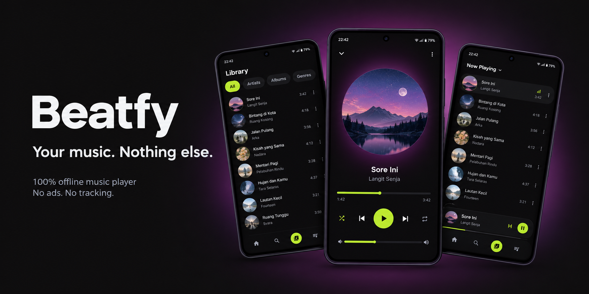

<div align="center">
  

  # Beatfy

  ### Offline music, exactly the way it should be.

  [](https://github.com/anandabint/beatfy/releases)
  [](https://github.com/anandabint/beatfy/blob/main/LICENSE)
  [](https://github.com/anandabint/beatfy/releases)

  [Download](#download) · [Features](#features) · [What's New](#whats-new) · [Support](#support) · [Privacy](#privacy)
</div>

Beatfy plays the MP3 files already on your Android phone. No streaming, no
ads, no third-party analytics, no account required. Built with Flutter.

---

<div align="center">
  

  <h1 id="features">Features</h1>
</div>

<table>
<tr>
<td width="50%" valign="top">

### 🎧 Playback

- Play/pause/seek/next/prev, shuffle, repeat (off/one/all), dynamic queue
- Now Playing screen with large album art and a scrubbing progress bar
- Persistent mini player, tap to expand
- Accurate state restore — reopen the app and your song, position, and
  queue are exactly as you left them (always resumes **paused**, so audio
  never blasts out unexpectedly)
- Full lock-screen & notification media controls, including Bluetooth
  headset buttons
- Auto-pause when your Bluetooth/wired audio output disconnects
- Optional audio enhancement (loudness & bass boost) — off by default, one
  toggle and an intensity slider in Settings when you want it

</td>
<td width="50%" valign="top">

### 📚 Library & Organization

- Auto-scan your library (device storage + Downloads folder), with smart
  filename cleanup
- Browse by album, artist, or folder
- Home tab: recently added + your Top 10 most-played
- Real-time search across title, artist, and album
- Playlists — create, rename, add/remove/reorder songs, multi-select songs
  to add in bulk
- Favorites
- Delete a song straight from your device (with an explicit, unmissable
  confirmation — it's permanent)
- Back up your library to **your own** Google Drive account, restored
  automatically on a new device

</td>
</tr>
</table>

---

<div align="center">
  <h1 id="download">Download</h1>
</div>

Grab the APK from the [Releases](../../releases) page. Since this isn't
published on the Play Store, Android will warn about installing from an
unknown source — that's normal for sideloaded APKs.

To verify the APK you downloaded matches the official release and hasn't
been tampered with, compare its SHA-256 signing fingerprint against the one
published here:

```
SHA-256: B3:2C:97:C4:AC:7D:83:80:EC:60:11:3D:10:D9:69:4C:4D:E5:C7:4B:16:4A:C0:D8:CF:F5:9E:50:18:84:D6:B7
```

### Building from source

```
flutter pub get
flutter run
```

#### Release build

The debug keystore is used automatically until a release keystore is set
up (`flutter build apk --release` will still work, but the resulting APK
must not be distributed until real signing is configured). To set one up:

1. Generate a keystore (do this once, keep the file and passwords safe —
   losing them means future releases can never be signed to match earlier
   ones):

   ```
   keytool -genkey -v -keystore beatfy-release.jks -keyalg RSA -keysize 2048 \
     -validity 10000 -alias beatfy
   ```

   Place the resulting `beatfy-release.jks` **outside** of version control
   (e.g. `android/beatfy-release.jks` — already covered by
   `android/.gitignore`'s `**/*.jks` rule).

2. Copy `android/key.properties.example` to `android/key.properties` and
   fill in the real `storePassword`/`keyPassword`/`storeFile` path.
   `key.properties` is git-ignored and must never be committed.

3. Build the release APK:

   ```
   flutter build apk --release
   ```

4. Get the SHA-256 fingerprint of the signing certificate (paste the result
   into the "Download" section above when publishing a release):

   ```
   keytool -list -v -keystore android/beatfy-release.jks -alias beatfy
   ```

---

<div align="center">
  <h1 id="whats-new">What's New</h1>
</div>

- **Home screen widget** with mini player controls _(in testing)_
- **Android Auto support** — browse and play your library from the car
  display _(in testing)_
- Audio enhancement (bass boost & clarity) is now an opt-in toggle with an
  intensity slider in Settings, off by default — it used to run
  automatically for everyone with a fixed gain
- Multi-select in Library (Album/Artist/Folder view) — select multiple
  songs and add them all to a playlist at once
- Song rows now show the track's own embedded artwork instead of falling
  back to shared album art
- Frosted-glass blur on the mini player and bottom navigation bar, so
  content scrolling behind them stays visible
- Beatfy is now officially licensed under [GNU GPLv3](LICENSE)
- **Bug fix**: "Laporkan Bug / Masukan" in Settings now actually opens your
  email app (it silently failed to launch on Android 11+)
- **Bug fix**: the last row in Library/Home/Playlist no longer hides behind
  the mini player and bottom nav bar

---

<div align="center">
  <h1 id="support">Support</h1>

  Beatfy is free, ad-free, and built as a personal project. If it's useful
  to you, a small tip is always appreciated (and never expected).

  [](https://ko-fi.com/bint29)
  [](https://paypal.me/anandabint)
</div>

---

<div align="center">
  <h1 id="privacy">Privacy</h1>
</div>

Beatfy does not collect any user data, and has no ads or third-party
analytics. The only data that ever leaves your device is the music files
backed up to **your own** Google Drive account, and only if you turn the
backup feature on — Beatfy has no server of its own that stores anything.

Google Sign-In is used solely to authorize that Drive backup and is entirely
optional; every core feature (offline playback) works fully without signing
in. The Drive access requested is the `drive.file` scope, which only grants
access to files Beatfy itself creates in your Drive — never your full Drive
contents.

Beatfy is open source, so you (or anyone) can read exactly what the code
does rather than take this description on faith.

### "Google hasn't verified this app"

If you sign in with Google, you may see a warning that Google hasn't
verified this app. That's expected and not a sign of malware — it's simply
what Google shows for any personal/open-source app that hasn't gone through
their (paid, business-oriented) verification process. Click through to
continue if you trust the source you downloaded the APK from (see above).
